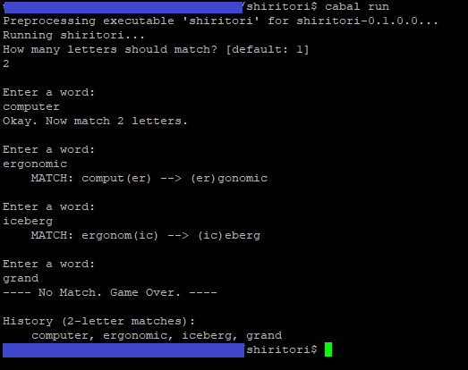

# What is This?
-------------------------------------------------------------------------------

This is an English adaptation of the Japanese game "Shiritori".

From Wikipedia:
    Shiritori is a Japanese word game in which the players are required to
    say a word which begins with the final kana of the previous word.
    No distinction is made between hiragana, katakana or kanji. "Shiritori"
    literally means "taking the end" or "taking the rear".
    URL:  https://en.wikipedia.org/wiki/Shiritori

# Technical Specifications
-------------------------------------------------------------------------------

Written in Haskell, using the Haskell Platform for Linux (Debian).
Cabal is used to organize the project.

# Game Rules
-------------------------------------------------------------------------------

* The objective is to match the beginning letters of your word with the ending
    letters of the previous word. For example, if the previous word was "apple"
    and the number of letters to match is 2, then you must enter a word that
    starts with the final two letters of "apple". Those letters are "le", so
    the word "lenses" would be a valid entry.
* When the game starts, you specify the number of letters to match.
* This adaptation is case-sensitive.
* Whitespace counts as normal text. You can match on spaces.
* Words are not checked for validity. You can type nonsense if you want,
    as long as the characters match.

# How to Build and Run the Application
-------------------------------------------------------------------------------

### Build

    $ cabal build

You may need to tweak `shiritori.cabal`, depending on your Haskell
environment.

### Run

    $ cabal run

Sample Gameplay
-------------------------------------------------------------------------------

    $ cabal run

    How many letters should match? [default: 1]
    2

    Enter a word:
    computer
    Okay. Now match 2 letters.

    Enter a word:
    ergonomic
        MATCH: comput(er) --> (er)gonomic

    Enter a word:
    iceberg
        MATCH: ergonom(ic) --> (ic)eberg

    Enter a word:
    grand
    ---- No Match. Game Over. ----

    History (2-letter matches):
        computer, ergonomic, iceberg, grand

### Screenshot:

